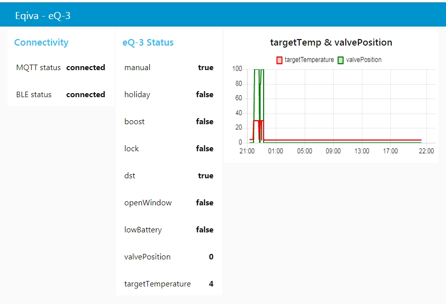

# Composite docker application with 3 containers ([Node-RED](https://nodered.org/), Nginx, MQTT broker) deployed on Raspberry Pi through [Balena](https://www.balena.io) for controlling an eqiva eQ-3 radiator thermostat 
## 1. Objective
The objective is to control an [eqiva eQ-3 radiator thermostat](https://www.eq-3.com/products/eqiva/bluetooth-smart-radiator-thermostat.html) (see image below) using a [Raspberry Pi 3 Model B+](https://www.raspberrypi.org/products/raspberry-pi-3-model-b-plus/).

The Raspberry Pi directly communicates with the eQ3 radiator thermostat over BLE (bluetooth low energy) using the [node-red-contrib-eq3-bluetooth node](https://github.com/alikh31/node-red-contrib-eq3-bluetooth).  This node is based on the reverse engineered BLE protocol : see [eQ-3 radiator thermostat API](https://github.com/Heckie75/eQ-3-radiator-thermostat/blob/master/eq-3-radiator-thermostat-api.md)

Via the intranet: MQTT messages can be sent to the Raspberry Pi to open/close the eQ3 thermostat, to request its status (including battery status), to set the target temperature of the thermostat, to switch to automatic/manual mode, ...

Moreover a simple UI is included that shows the current status of the thermostat (see screenshot below).

## 2. What

## 3. How to install this application on a Raspberry Pi
It is very easy to install this application using the [BalenaCloud](https://www.balena.io/) services through following steps:
1. [Balena Setup](https://www.balena.io/): you need a BalenaCloud account and your Raspberry Pi must be running the BalenaOs.  You also need to create an application in your balena dashboard and associate your Rasperry Pi to it (see balena documentation).
2. Within Balena dashboard you must set the user name and hashed password for the Node-RED editor as is specified in section 
3. clone this github repository (this can be done on any device where git is installed) through the following command `git clone https://github.com/janvda/balena-node-red-eq3.git` (instead of directly cloning the repository it might be better to fork the github repository and then clone this forked repository).
4.  
3. Move into this repository by command `cd balena-node-red-eq3`
4. Add balena git remote endpoint by running a command like `git remote add balena gh_janvda@git.balena-cloud.com:gh_janvda/pi3three.git` (the actual command for your setup can also be found in your balena dashboard under the application you have just created in the upper right corner)
5. push the repository to balena by the command `git push balena master` (maybe you need to add the option `--force` the first time you are deploying) and this will be build your application.

## 4. Node-RED Container
### 4.1 Setting Node-RED user name and password (Mandatory !)
The Node-RED editor is protected by a user name and a **hashed** password that must be set through the environment variables `USERNAME` and  `PASSWORD`. The [Node-RED security page](https://nodered.org/docs/security) describes how a password hash can be generated.  You can set these environment variables using your [Balena dashboard](https://dashboard.balena-cloud.com) under
 *Service Variables (S(X))*
 
## 5. Nginx Container

## 6. Issues or Feature Requests
Any issues or feature requests can be found or reported here: https://github.com/janvda/balena-node-red-eq3/issues
